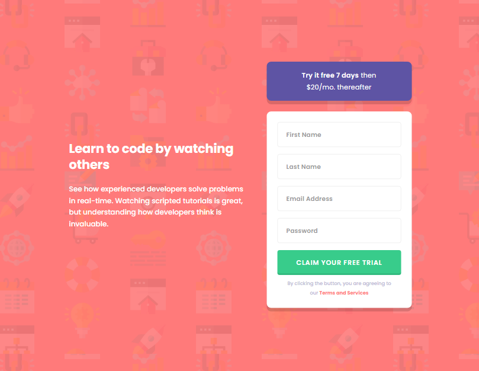

# Intro component with sign up form

## Table of contents

- [Overview](#overview)
  - [The challenge](#the-challenge)
  - [Screenshot](#screenshot)
  - [Links](#links)
- [My process](#my-process)
  - [Built with](#built-with)
  - [What I learned](#what-i-learned)
  - [Continued development](#continued-development)

## Overview
I found this challenge relatively easy. I'm going to move on to something a bit more difficult after this. The design only had a mobile and desktop version so I added a breakpoint inbetween.

If you have time I'd love some feedback on the following things.
How is my forms HTML?
How is my JS?
Any other feedback would be great.
### The challenge

Users should be able to:

- View the optimal layout for the site depending on their device's screen size
- See hover states for all interactive elements on the page
- Receive an error message when the `form` is submitted if:
  - Any `input` field is empty. The message for this error should say *"[Field Name] cannot be empty"*
  - The email address is not formatted correctly (i.e. a correct email address should have this structure: `name@host.tld`). The message for this error should say *"Looks like this is not an email"*

### Screenshot

### Links

- Solution URL: [https://github.com/arfarobs/intro-component-with-sign-up-form](https://github.com/arfarobs/intro-component-with-sign-up-form)
- Live Site URL: [https://arfarobs.github.io/intro-component-with-sign-up-form/](https://arfarobs.github.io/intro-component-with-sign-up-form/)

## My process
1. Write the HTML.
2. Download fonts.
3. Style mobile view.
4. Style tablet view.
5. Style desktop view.
6. Add active states.
7. Write the client side validation.
8. Refactor code.
9. Finish readme.
### Built with

- Semantic HTML5 markup
- CSS
- JavaScript
- Client Side Validation
- Flexbox
- Mobile-first workflow

### What I learned

The background shorthand. - I wouldn't say it is something that I learned, but it's something that I have made an effort to use.

### Continued development

I thought this was to easy so I am going to focus on something more complicated next time.

